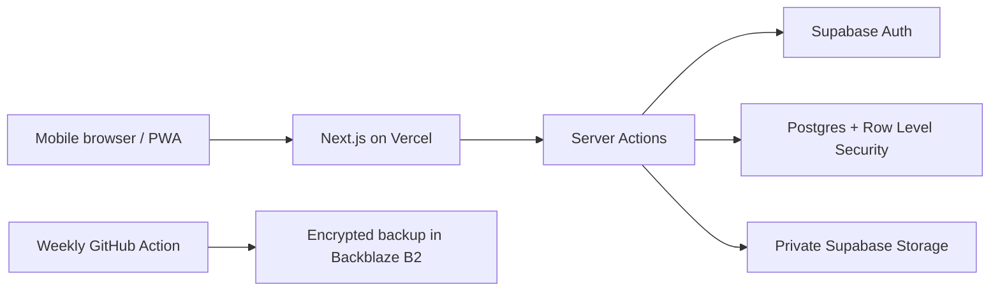

<div align="center">
  
  <h1>MedVault</h1>
  <p><strong>A private, mobile-first medical-record organizer built for my personal use in Morocco.</strong></p>
  <p>Cases, consultations, prescriptions, test results, doctors, and supporting documents in one single-user app.</p>

  <p>
    
    
    
    
    
  </p>
</div>

> [!IMPORTANT]
> MedVault is a private, single-user personal project. It is not intended for clinics, hospitals, insurers, or multiple users, and it is not a diagnostic or clinical decision-support tool. Public registration is disabled by design.

## Product tour

The screenshots below use entirely fictional demo data.

| Case overview | Case timeline | Consultation and test result | Doctor history |
|---|---|---|---|
|  |  |  |  |

## Why I built it

Medical information can easily become scattered across paper prescriptions, laboratory reports, messages, and separate clinic visits. I built MedVault for my own day-to-day use in Morocco: one private account, fast mobile data entry after appointments, and a clear timeline of how each consultation, prescription, result, and file relates to a health case.

The application is deployed privately. Visitors cannot create an account or view any records; the interface above is shown with fictional portfolio data.

## What it does

- Organizes records as **Case → Consultation → Prescription / Test Result**
- Maintains a reusable doctor directory with specialty, clinic, city, phone, notes, and an optional Google Maps link
- Filters cases by broad body system and supports free-text search across titles, notes, and test names
- Stores PDFs, images, HEIC files, and text attachments in a private Supabase bucket
- Generates short-lived signed URLs instead of exposing public file links
- Exports all structured data and original files as a portable ZIP archive
- Runs weekly database-and-storage backups to a separate Backblaze B2 bucket
- Installs on an iPhone home screen as a mobile-first PWA

## Architecture



The UI uses the Next.js App Router, TypeScript, Tailwind CSS, and shadcn/ui. Drizzle ORM owns the schema and migrations, while Supabase provides authentication, Postgres, and private object storage. See [the architecture document](docs/ARCHITECTURE.md) for the request flows and [the decision log](docs/DECISION_LOG.md) for the trade-offs behind the stack.

## Privacy and security choices

- One manually provisioned account with no public sign-up route
- Row Level Security enabled on every application table
- Private storage bucket with 60-second signed URLs
- Random storage keys that do not reveal original filenames
- Server-side file-type validation and a 25 MB upload limit
- No medical-record content written to application logs
- Secrets stored only in environment variables
- Documented backup and restore procedure

MedVault does **not** claim HIPAA, GDPR, or any other formal regulatory compliance. The project has not been independently assessed or certified.

## Local development

Requirements: Node.js 22+ and a Supabase project. Install `pg_dump` and `pg_restore` as well if you want to test backups locally.

```bash
npm install
cp .env.example .env.local
npm run db:migrate
npm run dev
```

Open [http://localhost:3000](http://localhost:3000). Environment variables are documented in [docs/ENVIRONMENT.md](docs/ENVIRONMENT.md).

### Useful commands

```bash
npm run build         # production build and TypeScript check
npm run lint          # ESLint
npm test              # Vitest unit and logic tests
npm run db:generate   # generate SQL migrations
npm run db:migrate    # apply migrations
npm run db:studio     # inspect the database with Drizzle Studio
npm run backup        # run the backup workflow locally
```

## Deployment outline

1. Create a Supabase project and configure the database, authentication, and storage environment variables.
2. Run the Drizzle migrations.
3. Apply `src/db/rls-policies.sql` to enable RLS and create the private storage bucket.
4. Verify the policies with `npx tsx scripts/verify-rls.ts`.
5. Manually provision the single user in Supabase Auth.
6. Deploy the Next.js application to Vercel.
7. Configure the weekly encrypted backup workflow and complete a test restore.

The complete setup procedure is documented in [docs/ENVIRONMENT.md](docs/ENVIRONMENT.md) and [docs/BACKUP_RESTORE.md](docs/BACKUP_RESTORE.md).

## Documentation

| Document | Contents |
|---|---|
| [Product specification](docs/SPEC.md) | Approved scope, exclusions, data model, and security requirements |
| [Architecture](docs/ARCHITECTURE.md) | System diagram and request flows |
| [API reference](docs/API.md) | Server Actions and route handlers |
| [Environment](docs/ENVIRONMENT.md) | Environment variables and deployment configuration |
| [Backup and restore](docs/BACKUP_RESTORE.md) | Backup schedule, secrets, retention, and recovery |
| [Decision log](docs/DECISION_LOG.md) | Important technical decisions and alternatives considered |
| [Known limitations](docs/KNOWN_LIMITATIONS.md) | Deliberately deferred functionality |

## Deliberate boundaries

MedVault does not include OCR, AI interpretation, diagnosis or treatment suggestions, reminders, public sharing, multi-user access, camera scanning, or offline caching of medical data. These boundaries keep the project focused on private organization rather than clinical decision-making.
